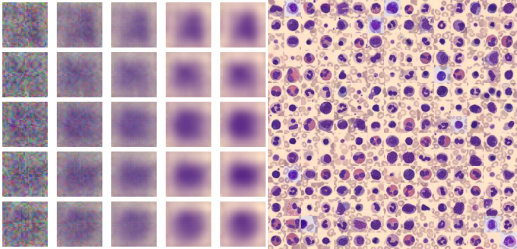
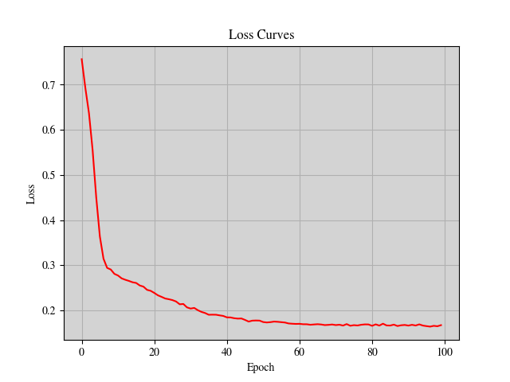

# Enhancing Biomedical Data Generation with Diffusion Mode Synthesis

 
## Inspiration

Image synthesis on medical images holds immense potential for generating more data to address biomedical problems. 
However, legal and technical limitations often hinder this process. This project explores Diffusion Models, a powerful approach, to overcome these limitations and contribute to advancements in medical data generation.
 

## What It Does 

This project implements a Diffusion Model for image synthesis on medical datasets. 
The model leverages a U-Net architecture to progressively restore noisy medical images to their original state. 

## How We built it 

1. **Data Preprocessing:** The BloodMNIST dataset, a subset of the MedMNIST dataset, is used to train the diffusion model.
2. **Diffusion Model Architecture:** The model employs a forward process that adds Gaussian noise to an image, guided by a noise scheduler. This process is followed by a U-Net-based backward process that restores the image.
3. **Evaluation:** The model's performance is quantitatively assessed using Fréchet Inception Distance (FID) and Kernel Inception Distance (KID).

 

## What I learned 

This project provided valuable insights into:

*Building application using intel oneDAL:The Intel oneAPI Data Analytics Library (oneDAL) contributes to the acceleration of big data analysis by providing highly optimised algorithmic building blocks for all phases of data analytics (preprocessing, transformation, analysis, modelling, validation, and decision making) in batch, online, and distributed processing modes of computation.The library optimizes data ingestion along with algorithmic computation to increase throughput and scalability.
* The capabilities of Diffusion Models for biomedical image synthesis.
* The effectiveness of U-Net architecture in image restoration tasks.
* The importance of quantitative metrics (FID and KID) to evaluate model performance.

**Additional Notes**

Qualitative results showcasing generated images are provided in the `qualitative_result.jpg` file.
