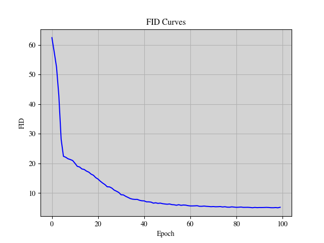
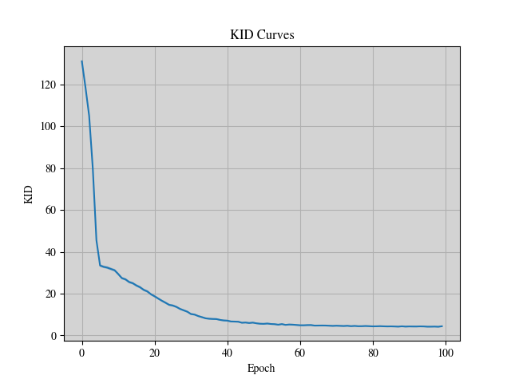

# Enhancing Biomedical Data Generation with Diffusion Mode Synthesis

 
## Inspiration
Biomedical research often gets stuck because of limited data. Getting access to medical images, for instance, is a bureaucratic nightmare! That's why I'm excited about diffusion models. They offer a powerful way to generate new data, and that could be a game-changer for this field.  This project is my chance to contribute and make a real difference.
 

## What It Does 
This project focuses on enhancing the performance of image segmentation tasks, particularly in the context of medical imaging using the BloodMNIST dataset. It involves the development of a comprehensive framework that integrates a diffusion model architecture with a noise scheduler and U-Net. The dataset is prepared by resizing and splitting into training, validation, and test sets. The diffusion model applies dynamic noise addition guided by the noise scheduler, while the U-Net aids in accurate segmentation of blood cell images. Evaluation metrics such as loss curves, FID, and KID curves are employed to assess model performance. Through this project, insights are gained into the process of data augmentation, model training, and evaluation, contributing to advancements in medical image analysis and potentially improving diagnostic accuracy and treatment outcomes.
 

## How We built it 

**1. Importing the Libraries:**
We initiate the process by importing essential libraries for deep learning such as TensorFlow or PyTorch, along with libraries for data manipulation (e.g., NumPy, pandas) and visualization (e.g., Matplotlib).

**2. Dataset Preparation:**
We load the BloodMNIST dataset, which consists of images of normal blood cells from healthy individuals. The dataset is divided into training, validation, and test sets with a split ratio of 7:1:2. Initially, the images with a resolution of 3×360×363 pixels are center-cropped to 3×200×200 pixels, and then resized to 3×28×28 pixels to match the input size required by the model.

**3. Diffusion Model Architecture with Noise Scheduler:**
The diffusion model architecture is implemented, which involves a forward process applying Gaussian noise to an image guided by a noise scheduler. This process is followed by a U-Net-based backward process that restores the image to its original state. The noise scheduler dynamically adjusts the level and type of noise added during training to enhance model robustness and generalization. The U-Net architecture within this framework aids in image segmentation tasks, effectively capturing intricate patterns in the blood cell images. A wrapper is utilized to integrate the noise scheduler and U-Net architecture, facilitating data augmentation, training, and testing of the BloodMNIST dataset.

**4. Performance Evaluation:**
The performance of the trained model is evaluated by plotting various curves. Loss curves illustrate the convergence and training progress of the model. FID (Fréchet Inception Distance) and KID (Kernel Inception Distance) curves measure the similarity between generated and real images, providing insights into the quality of generated samples and the model's performance in accurately segmenting blood cell images.

Through these steps, we build a comprehensive framework for data augmentation, training, and evaluation of the BloodMNIST dataset using diffusion model architecture, noise scheduler, U-Net, and wrapper. 

 

 

## What I learned 

This project provided valuable insights into:

* Building application using intel oneDAL:The Intel oneAPI Data Analytics Library (oneDAL) contributes to the acceleration of big data analysis by providing highly optimised algorithmic building blocks for all phases of data analytics (preprocessing, transformation, analysis, modelling, validation, and decision making) in batch, online, and distributed processing modes of computation.The library optimizes data ingestion along with algorithmic computation to increase throughput and scalability.
* The capabilities of Diffusion Models for biomedical image synthesis.
* The effectiveness of U-Net architecture in image restoration tasks.
* The importance of quantitative metrics (FID and KID) to evaluate model performance.
